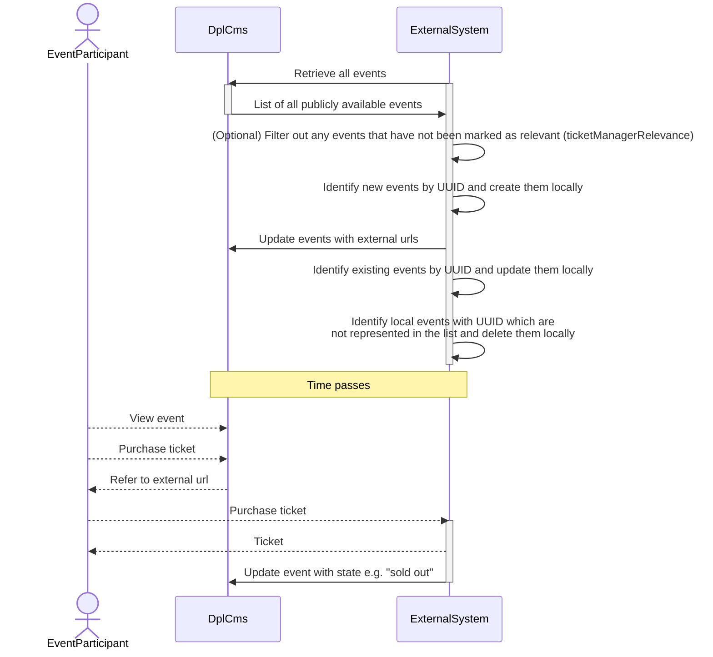

# Event integration

Events make up an important part of the overall activities the Danish Public
Libraries. One business aspect of these events is ticketing. Municipalities
in Denmark use different external vendors for handling this responsibility
which includes functionalities such payment, keeping track of availability,
validation, seating etc.

One goal for libraries is to keep staff workflows as simple as possible and
avoid duplicate data entry. To achieve this DPL CMS exposes data and
functionality as a part of [the public API of the system](./architecture/adr-006-api-specification.md).

## Data synchronization

[The public API for DPL CMS is documented through an OpenAPI 2.0 specification](../../cms/openapi.json).

The following flow diagram represents a suggested approach for synchronizing
event data between DPL CMS and an external system.

<!-- markdownlint-disable MD013 -->

<!-- markdownlint-enable MD013 -->

### External data

The `PATCH` payload also accepts an `externalData` object which the
external system can use to attach its own URL and reference to an event
(for example, a link to the ticket purchase page on the external system).
This is what the "Update events with external urls" step in the sequence
diagram refers to.

## Configuration affecting integration

Administrators configure event-related behaviour at
`/admin/config/dpl-event/settings`. The settings that affect integrations
are:

- **Price Currency** — the currency used when prices are emitted in API
  responses (defaults to `DKK`).
- **Automatic unpublication** — when enabled, instances are automatically
  unpublished a configurable interval after their end time, and (optionally)
  the parent series is unpublished once all of its instances have been
  unpublished. Unpublished events disappear from `GET /api/v1/events`, so
  external systems must be prepared to delete their local copies in
  response.

## Authentication

An external system which intends to integrate with events is setup in the same
way as library staff. It is represented by a Drupal user and must be assigned
an appropriate username, password and role by a local administrator for the
library. This information must be communicated to the external system through
other secure means.

The external system must authenticate through [HTTP basic auth](https://swagger.io/docs/specification/2-0/authentication/basic-authentication/)
using this information when updating events.

## API versioning

Please read [the related ADR](./architecture/adr-012-api-versioning.md) for how
we handle API versioning.
