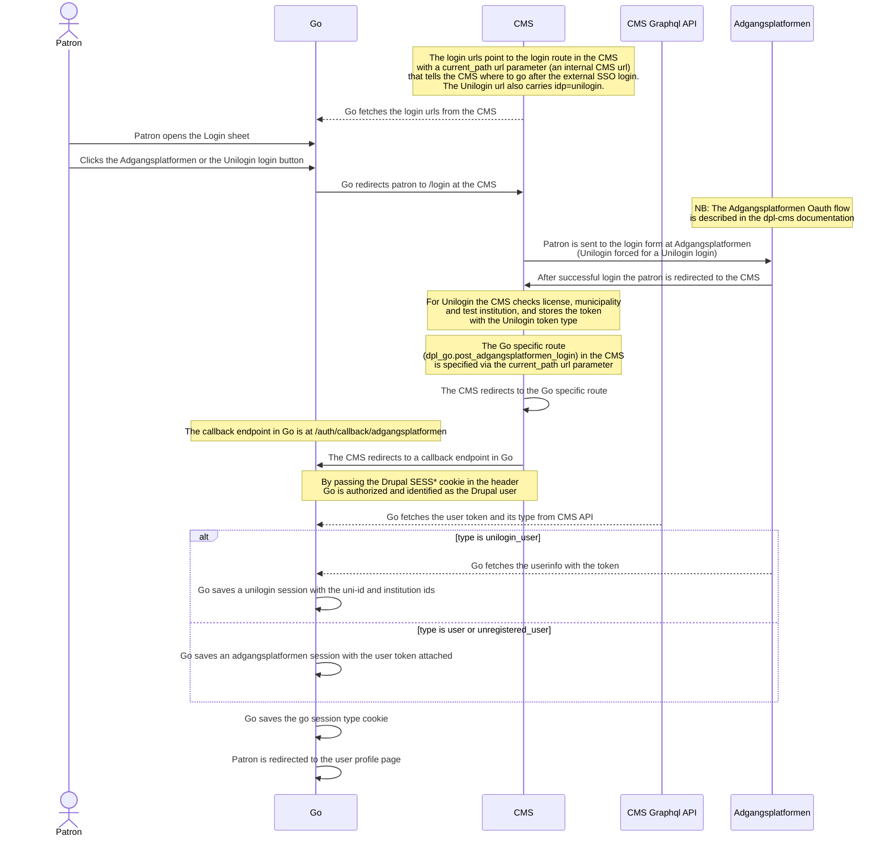
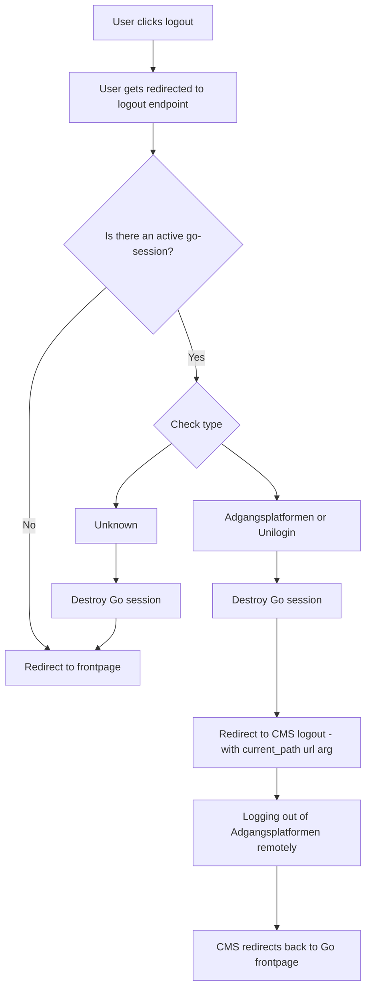
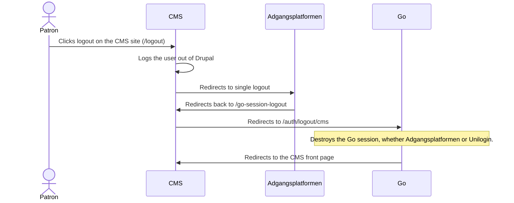

# Authentication

## General

There are two ways of logging into the Go application:

- Via [Adgangsplatformen](https://danbib.dk/login)
- Via [Unilogin](https://viden.stil.dk/display/OFFSKOLELOGIN/Unilogin)

Both run through the CMS and Adgangsplatformen. A Unilogin login is an
Adgangsplatformen login with Unilogin forced as identity provider. The type
of the user token the CMS hands out decides which kind of Go session is
created. See ADR-013.

## Go session

The Go session is maintained by using the [iron-session](https://www.npmjs.com/package/iron-session)
tool.
The session data is stored in a cookie encrypted and is only readable server side.
The go session cookie is used for patrons logging in with either Unilogin or
Adgangsplatformen and has two major attributes:

**isLoggedIn** - can be either `true` or `false`

and

**type** - can be either:

- `anonymous`
- `unilogin`
- `adgangsplatformen`

The overall authorization behavior of the Go application is controlled by these
parameters.

### Session data per type

The session data is typed as `TSessionData` in `lib/session/session.ts`. Which
fields are set depends on the session type:

| Field | `anonymous` | `adgangsplatformen` | `unilogin` |
| --- | --- | --- | --- |
| `isLoggedIn` | `false` | `true` | `true` |
| `type` | `"anonymous"` | `"adgangsplatformen"` | `"unilogin"` |
| `expires` | – | Expiry of the user token | Expiry of the user token |
| `userToken` | – | The patron's user token | The student's user token |
| `user` | – | `{ name }`, if FBS returned one | `{ username }`, the uni-id |
| `uniLoginUserInfo` | – | – | `{ uniid, institutionIds }` |
| `adgangsplatformenLibraryToken` | From cookie | From cookie | From cookie |
| `validatedAt` | – | Last CMS check | Last CMS check |

- **`userToken`** is kept for both types, but only a patron's token is sent to
  FBS, FBI and the other services. `getPatronUserToken()` returns it for an
  `adgangsplatformen` session only, and `bearer-token.ts` and the
  `/ap-service` proxy use that. A student's token is kept for later use, e.g.
  towards Publizon.
- **`uniLoginUserInfo`** is what the local Pubhub adapter needs: the uni-id is
  the card number, and loans go through the first institution. See
  "Unilogin user info" below.
- **`adgangsplatformenLibraryToken`** is copied from the library token cookie
  by `getSession()` on every request, whatever the session type.
- **`validatedAt`** records when the middleware last asked the CMS whether the
  session is still alive (ADR-012).
- **The user token never reaches the browser.** `/auth/session` leaves out
  `userToken` and `adgangsplatformenLibraryToken`. Client code that only needs
  the type reads the `go-session:type` cookie (see below).
- **Sessions from before the rename** stored the user token as
  `adgangsplatformenUserToken`. `getSession()` moves it to `userToken`
  (`migrateLegacySession()`), so patrons stay logged in across the release. The
  migration can be removed once those sessions have expired, after at most a
  week.

## Go session type cookie

Because we need a different behavior of the application depending of the session
type ("unilogin" or "adgangsplatformen") and we don't want to call our session
endpoint every time we decided to create a cookie called "go-session:type". Since
it is not sensitive data we can make it accessible both client and server side.
The cookie is for instance used to decide whether we need to contacting our own
Pubhub API or the Publizon adapter when requesting Publizon data.

## Login

The Login sheet has a button for each login type. Both lead to a login URL
fetched from the CMS (`goConfiguration.public.loginUrls`). The Unilogin URL
adds `idp=unilogin`, which makes the CMS force Unilogin at Adgangsplatformen.

`loadUserToken()` maps the CMS token type to the session type, and
`saveSessionFromUserToken()` creates the session. The middleware uses the
same function when an anonymous visitor already has a live Drupal session,
so the session type always follows the token type.

### Unilogin user info

The local Pubhub adapter (ADR-005) needs the student's uni-id, which is the
card number, and institution ids, of which loans go through the first. Go
reads them from the Adgangsplatformen userinfo endpoint
(`auth.adgangsplatformen-userinfo-url`, overridable with
`ADGANGSPLATFORMEN_USERINFO_URL`) in `lib/helpers/unilogin.ts`. The claim
names there must match the CMS. The institution ids come as one string,
`"[ABC111,CDA222]"`, or `""` when there are none. DDF's test institution `R00263` is
mapped to an institution Publizon knows.

The Unilogin token is stored in the session like a patron's, but the student
is not a patron, so Go never sends it to FBS or FBI. If the userinfo cannot be
read, no session is created and the user lands on the Unilogin login failed
page.

## Logout

When a user click logout we need to handle that the current session either can be:

- Adgangsplatformen
- Unilogin
- Anonymous
- In a, for some reason, broken state

Adgangsplatformen and Unilogin sessions both live on the Drupal session and
log out the same way:

### Logout initiated on the CMS site

The session is shared with the CMS site, but the
`go-session` cookie is host-only on the Go host — the CMS cannot clear it in
its own responses. Logouts initiated on the CMS site (the logout button on
the library site) therefore detour through Go:

Go-initiated logouts pass `current-path=/go-logout` to the CMS and skip the
detour — the Go session is already destroyed before the redirect.

## Token handling

### Token types

We have two different token types:

- User token
- Library token

#### User token

Both session types start from a user token that the CMS got from
Adgangsplatformen. The CMS labels it with a type: `user` and
`unregistered_user` for patrons, `unilogin_user` for students.

The user token is kept in the `go-session` iron-session cookie as `userToken`,
whatever the session type. It never reaches the browser: `/auth/session` leaves
it out, and requests to the services go through the `/ap-service` proxy, which
adds the token server-side. Only a patron's token is sent as a user token
(`getPatronUserToken()`); a Unilogin student's token is kept for later use, e.g.
towards Publizon.

The user token cannot be renewed, so the Go session lives exactly as long as
the token, whatever its type (see ADR-012 and ADR-013). Drupal logs out users
whose token has expired, on the first request that reaches it — including the
one Go makes to read the token. When it expires:

- `loadUserToken()` gets nothing back, so a lingering Drupal session cookie
  cannot recreate a dead session. Go does not check the expiry itself — no
  token from the CMS means no session. A 401 or 403 counts as "no token";
  only a transport failure counts as an error, and an error never ends a
  session.
- The middleware re-asks the CMS even for a session that still looks live,
  since Drupal may have retired it while the services keep accepting the
  token. The answer is trusted for 30 seconds
  (`auth.session-validation-ttl-seconds`), so this costs at most one CMS call
  per session per window rather than one per request. A token of another type
  than the session also ends the session: somebody else has logged in on the
  CMS in this browser.
- The middleware destroys the expired Go session and lets the request
  continue as anonymous. The Adgangsplatformen SSO session is left alone, so
  logging in again is a round trip the user barely notices.
- The `/ap-service` proxy checks expiry itself and destroys the session when
  the upstream rejects the session's user token with 401/403 — this also
  catches tokens revoked before their expire timestamp.

#### Library token

The documentation of the library token does not really belong here since it is
not a part of the session or authentication process.
But since we document all the token here it is worth mentioning.

The library token is fetched regularly in the middleware and set as a cookie.
Whenever it expired a new library token is fetched and the cookie is updated.
As mentioned before it is a separate system and not coupled to the session handling.
